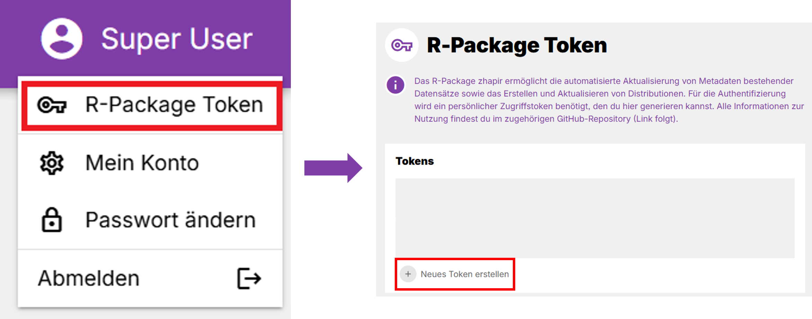

<!-- README.md is generated from README.Rmd. Please edit that file -->

```{r, include = FALSE}
knitr::opts_chunk$set(
  collapse = TRUE,
  comment = "#>",
  fig.path = "man/figures/README-",
  out.width = "100%"
)
```

# 📦 zhapir

<!-- badges: start -->

[](https://github.com/openZH/zhapir/actions/workflows/R-CMD-check.yaml)

<!-- badges: end -->

**zhapir** ist ein R-Paket für die automatisierte Erstellung und Aktualisierung von **Datensätzen** und **Distributionen** in der kantonalen *Metadatenverwaltung (MDV)*.\

Damit können Inhalte für [zh.ch/opendata](https://zh.ch/opendata) und [opendata.swiss](https://opendata.swiss) effizient gepflegt werden.

👉 Für detaillierte Workflows siehe die Vignette:\

`vignette("best_practices", package = "zhapir")`

## 🚀 Installation

Das Paket wird über GitHub installiert:

``` r
# install.packages("remotes")
remotes::install_github("statistikZH/zhapir")
```

## 🔑 API Key einrichten

Ein API Key ist Voraussetzung, um mit der MDV zu arbeiten.\
Diesen erzeugst du in der GUI:

1.  🔐 **API Key generieren**

    

    Hier könnt ihr einen beliebigen Namen für den Token wählen. Es ist möglich einen Token ohne Ablaufdatum zu genieren (einfach Ablaufdatum frei lassen).

2.  In `.Renviron` eintragen:

    ```{r eval=FALSE}
    # Dies öffnet deinen .Renviron file
    usethis::edit_r_environ()
    ```

    Den API-Key als ZHAPIR_API_KEY eintragen. Hier ist der Namen wichtig, da der Key automatisch vom Package ausgelesen wird.

    ```{r eval=FALSE}
    ZHAPIR_API_KEY="xxxxxxxxxxxxxxxx"
    ```

    ❗**Danach die R-Session neu starten, damit die Änderung wirksam wird.** ❗

## ⚠️ Wichtig: Entwicklungs- vs. Produktions-Umgebung

Standardmässig verwendet `zhapir` die **Entwicklungs-URL** (`use_dev = TRUE`).\
Für produktive Änderungen muss explizit `use_dev = FALSE` gesetzt werden:

```{r eval=FALSE}
ds <- zhapir::create_dataset(
  title           = "Prod Datensatz",
  organisation_id = 14,
  description     = "In PROD erstellt",
  use_dev         = FALSE   # 👉 PROD statt DEV
)
```

## ✨ Beispiele

### Datensatz erstellen

```{r eval=FALSE}
ds <- zhapir::create_dataset(
  title           = "Beispiel Datensatz",
  organisation_id = 14,
  description     = "Automatisiert erstellt mit zhapir",
  contact_email   = "team@example.org",
  theme_ids       = c("Bevölkerung"),
  periodicity_id  = "Jährlich",
  use_dev         = FALSE
)
```

ℹ️ Neue Datensätze sind in der MDV **immer „Entwurf“**.\
Eine Publikation ist nur über die grafische Oberfläche möglich und erfolgt immer erst nach der Prüfung durch die Data Guides. Neue Distributionen anlegen oder bestehende Distributionen updaten lässt sich aber vollständig über die API/R erledigen.

ℹ️ Es ist nicht notwendig das Ergebnis der Funktionen (z.B. `zhapir::create_distribution()`) per `<-` zuzuweisen. Wir nutzen dies hier, um mit der ID eines Datensatzes oder einer Distribution weiterzuarbeiten.

### Distribution hinzufügen

```{r eval=FALSE}
# Temporär CSV erstellen 
tmpfile <- base::tempfile(fileext = ".csv")
utils::write.csv(data.frame(a = 1:3), tmpfile, row.names = FALSE)

# Neue Distribution mit angehängter Datei hochladen
dist <- zhapir::create_distribution(
  title       = "Beispiel Distribution",
  dataset_id  = ds$id, # Das funktioniert, weil wir oben ds erstellt haben - sonst einfach im GUI die ID (=Nummer) heraussuchen.
  file_path   = tmpfile,
  ogd_flag    = TRUE,
  zh_web_flag = TRUE,
  use_dev     = FALSE
)
```

👉 **Kniff:** Über `update_distribution()` kannst du auch **Parameter auf Dataset-Ebene** anpassen, ohne separat `update_dataset()` aufzurufen – z. B. `end_date` oder `modified_next`:

```{r eval=FALSE}
dist <- zhapir::update_distribution(
  id            = dist$id,
  modified_next = "2026-01-01", # nächstes geplantes Update
  end_date      = "2025-12-31", # Ende der Zeitspanne
  use_dev       = FALSE
)
```

### Datensatz aktualisieren

```{r eval=FALSE}
ds <- zhapir::update_dataset(
  id            = ds$id,
  description   = "Neue Beschreibung",
  modified_next = "2026-01-01",
  use_dev       = FALSE
)
```

### Distribution aktualisieren

```{r eval=FALSE}
dist <- zhapir::update_distribution(
  id          = dist$id,
  description = "Neue Beschreibung Distribution",
  use_dev     = FALSE
)
```

## 🔍 IDs: Labels ↔︎ Codes

Viele Argumente akzeptieren **Labels** (z. B. `"Bevölkerung"`) oder **IDs** (z. B. `41`):

```{r eval=FALSE}
# via Label
ds1 <- zhapir::create_dataset(
  title           = "Per Label",
  organisation_id = 14,
  theme_ids       = "Bevölkerung",
  use_dev         = FALSE
)

# via ID
ds2 <- zhapir::create_dataset(
  title           = "Per ID",
  organisation_id = 14,
  theme_ids       = 41,
  use_dev         = FALSE
)
```

Bei Tippfehlern gibt `zhapir` klare Fehlermeldungen mit Hinweisen, z. B.:

``` r
x befölkerung not valid
• run get_themes()
```

Folgende Argumente akzeptieren **Labels** und **IDs**:

-   `keyword_ids`
-   `zh_web_datacatalog_ids`
-   `theme_ids`
-   `periodicity_id`
-   `status_id`
-   `file_format_id`

Folgende Argumente akzeptieren ausschliesslich IDs:

-   `organisation_id`
-   `dataset_id`
-   `license_id`

Mit den `get_[Argument]`-Funktionen können die verfügbaren Labels sowie die dazugehörigen IDs aufgerufen werden, z.B. für `themes`:

```{r eval=FALSE}
# Finde alle `themes`
zhapir::get_themes()

# Finde alle `themes`, welche den den String "Verkehr" enthalten (können auch mehrere Strings sein)
zhapir::get_themes("Verkehr")

# Finde alle `themes`, welche die ID 41 enthalten (können auch mehrere IDs sein)
zhapir::get_themes(41)
```

> **Wichtig**: `get_organisations()` gibt ausschliesslich alle Organisationen zurück und erlaubt keine Strings oder ID als Input.


## 🚫 Einschränkungen

Das Paket kann **nicht**:

-   den **Status** eines Datensatzes setzen (neue Datensätze sind immer „Entwurf“)

-   eine **Publikation** anstossen

Diese Schritte erfolgen ausschliesslich über die grafische Oberfläche des Datenkatalogs.

## 📄 Lizenz

Codelizenz: © 2025 Statistisches Amt Kanton Zürich (siehe `LICENSE`)
